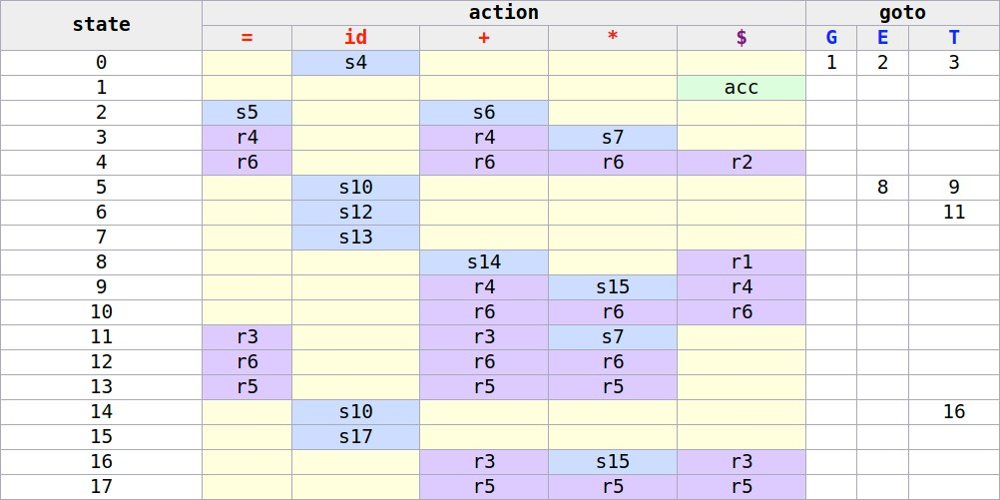

# LR(1) Parser Vis

Create [LR(1) parsers](https://en.wikipedia.org/wiki/Canonical_LR_parser) in your browser and see how they work.

## Live Demo

Check out the [**live demo**](https://soroushj.github.io/lr1-parser-vis)!

## Credits

The sample grammar is taken from [CSCE 434-500: Compiler Design](https://parasol.tamu.edu/~rwerger/Courses/434/).
